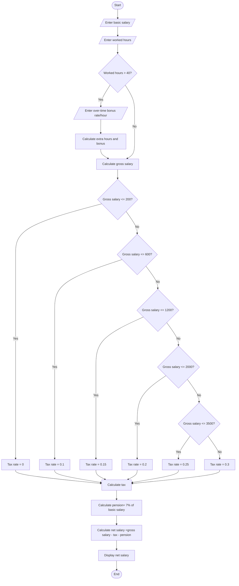

Problem Analysis 

1. Input
     - Basic Salary: The initial salary of the employee.
     - Worked Hours: The number of hours worked during the period.
     - Overtime Bonus Rate (if applicable): The rate paid per hour for overtime work. This is only requested if the worked hours exceed 40 hours.
2. Process
   
    - The net salary is calculated using the formula:
      - Net Salary = Gross Salary − Tax − Pension
    
3. Output :
    The net salary after applying the deductions for tax and pension.

Pseudocode

1. Start

2. Declare variables:
   - basic_salary (integer): The basic salary of the employee.
   - worked_hours (integer): The number of hours worked.
   - bonus_rate (integer): The rate for overtime per hour (if applicable).
   - extra_hour (integer): The number of overtime hours worked (if applicable).
   - gross_salary (double): The total salary including overtime.
   - tax_rate (double): The tax rate based on gross salary.
   - tax (double): The amount of tax to be deducted.
   - pension (double): The pension deduction (7% of basic salary).
   - net_salary (double): The final salary after deductions.

3. Prompt the user to enter:
   - basic_salary
   - worked_hours

4. If worked_hours > 40, calculate the overtime:
   - extra_hour = worked_hours - 40
   - bonus = extra_hour * bonus_rate
   - gross_salary = basic_salary + bonus

5. If worked_hours <= 40, set gross_salary to basic_salary.

6. Determine the tax rate based on gross_salary:
   - If gross_salary <= 200, set tax_rate to 0
   - Else if gross_salary <= 600, set tax_rate to 0.1
   - Else if gross_salary <= 1200, set tax_rate to 0.15
   - Else if gross_salary <= 2000, set tax_rate to 0.2
   - Else if gross_salary <= 3500, set tax_rate to 0.25
   - Else set tax_rate to 0.3

7. Calculate tax as tax = gross_salary * tax_rate

8. Calculate pension as pension = basic_salary * 0.07

9. Calculate net_salary as net_salary = gross_salary - tax - pension

10. Output the net_salary

11. End

FLOWCHART

