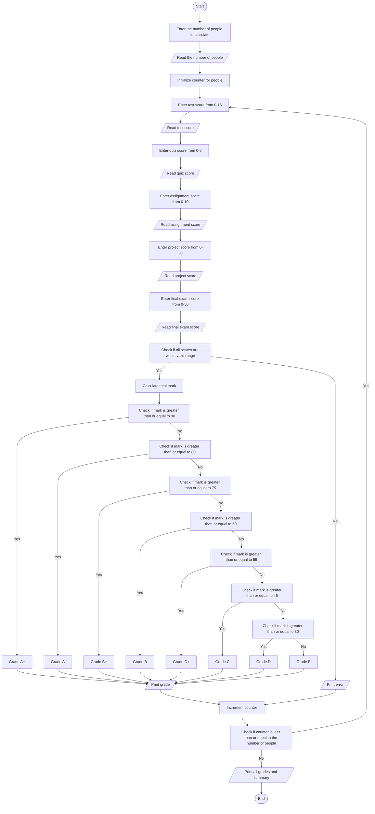

Problem Analysis

1. Input :
    - The user provides the number of people for whom the program will calculate scores.
    - For each person, the program will input scores for the test, quiz, assignment, project, and final exam.
2. process :

    - The program calculates the sum of all the scores for each person.
    - Grade Assignment:
    - Based on the total score, a grade is assigned according to the following rules:
    - A+ for marks 90 and above.
    - A for marks between 80 and 89.
    - B+ for marks between 75 and 79.
    - B for marks between 60 and 74.
    - C+ for marks between 55 and 59.
    - C for marks between 45 and 54.
    - D for marks between 30 and 44.
    - F for marks below 30.
3. Input : grade


Pseudocode

1. Start
2. Declare variable `number_of_people` to store the number of people.
3. Prompt the user to "Enter the number of people you want to calculate".
4. Read `number_of_people`.

5. For each person from 1 to `number_of_people`:
   a. Initialize variables `test`, `quiz`, `assignment`, `project`, `final_exam`, `mark`.
   b. Prompt the user for input:
      - "Enter your test score (0-15)" and read `test`.
      - "Enter your quiz score (0-5)" and read `quiz`.
      - "Enter your assignment score (0-10)" and read `assignment`.
      - "Enter your project score (0-20)" and read `project`.
      - "Enter your final exam score (0-50)" and read `final_exam`.
   c. Validate the input to ensure each score is within the valid range:
      - If any score is out of range, prompt the user to enter the score again.
   d. Calculate the total mark: `mark = test + quiz + assignment + project + final_exam`.
   e. Display the total mark.
   
6. Assign the grade based on the total mark:
   - If `mark >= 90`, print "Grade: A+".
   - Else if `mark >= 80`, print "Grade: A".
   - Else if `mark >= 75`, print "Grade: B+".
   - Else if `mark >= 60`, print "Grade: B".
   - Else if `mark >= 55`, print "Grade: C+".
   - Else if `mark >= 45`, print "Grade: C".
   - Else if `mark >= 30`, print "Grade: D".
   - Else print "Grade: F".

7. Repeat the process for each person.
8. End

# Flowchart for Grade Calculation Program


```
