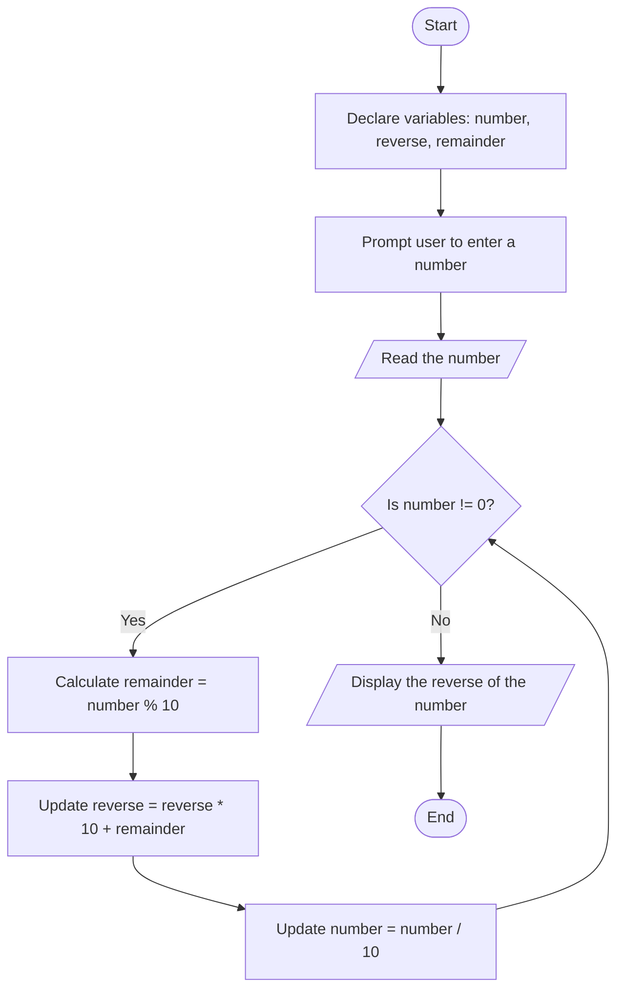

Problem Analysis 
1. Input:
    User input: A single integer, number.
2. Process:
    - Initialize reverse = 0 to store the reversed number.
    - While number != 0 (i.e., there are still digits to process):
        - Calculate the remainder (remainder = number % 10) to get the last digit of the number.
        - Update the reversed number (reverse = reverse * 10 + remainder).
        - Remove the last digit from number (number = number / 10).
        - After the loop, reverse will hold the reversed number.
    Print the reversed number.
3. Output:
    The program will output the reversed number.

Pseudocode
1. START
2. PRINT "Enter a number: "
3. READ number
4. Initialize reverse = 0
    WHILE number != 0 DO
        remainder = number % 10
        reverse = reverse * 10 + remainder
        number = number / 10
    END WHILE
    
5. PRINT "The reverse of the number is: " + reverse
6. END


# Flowchart for Reversing a Number


```
