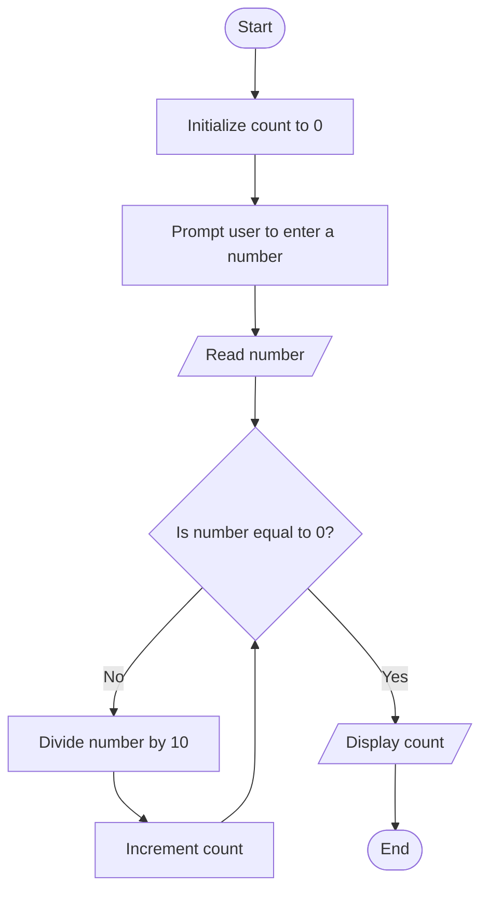

Problem Analysis

1. Input Handling: Take an integer number as input.
2. process:
   - Use a while loop to count the digits by repeatedly dividing the number by 10.
   - Each division removes the last digit of the number.
   - The loop continues until the number becomes 0.
3. Output: Display the total count of digits.
   
Pseudocode
1. Start
2. Declare variables:
   - `number` (integer): Stores the input number.
   - `count` (integer, initialized to 0): Tracks the number of digits.
3. Prompt the user to "Enter a number".
4. Read the input value into `number`.
5. While `number` is not 0:
   a. Increment `count` by 1.
   b. Update `number` by dividing it by 10 (integer division).
6. Print "The number of digits in the number is: <count>".
7.End

# Flowchart for Counting Digits in a Number


```
