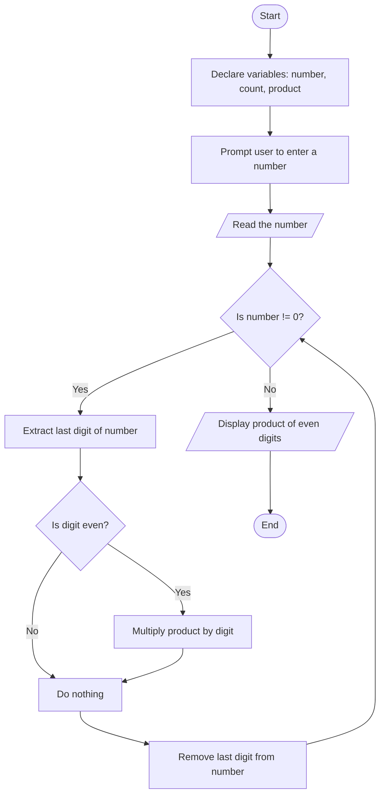

Problem Analysis

1. Input Handling: Take an integer as input.
2. Process:
    - Use a while loop to extract each digit of the number using modulo and integer division.
    - Check if the extracted digit is even (i.e., divisible by 2).
    - If the digit is even, multiply it with product.
3. Output: Display the calculated product of all even digits.

Pseudocode

1. Start
2. Declare variables:
   - `number` (integer): Stores the input number.
   - `product` (integer, initialized to 1): Stores the product of even digits.
3. Prompt the user to "Enter a number".
4. Read the input value into `number`.
5. While `number` is not 0:
   
       -  Extract the last digit using `digit = number % 10`.
       -  Check if `digit` is even (i.e., `digit % 2 == 0`):
          -  If true, update `product = product * digit`.
       -  Remove the last digit by `number = number / 10`.
7. Print "The product of even digits in the number is: <product>".
8. End

   # Flowchart for the Program


```
