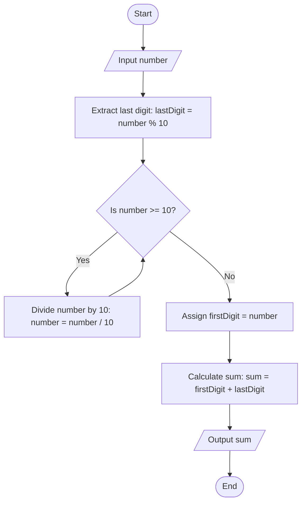

Problem Analysis

1. Input Handling: Read an integer from the user.
2. process:
   
    - Extract Last Digit:
    - Use the modulo operator (% 10) to find the last digit of the number.
    - Extract First Digit:
    - Use a while loop to repeatedly divide the number by 10 until only the first digit remains.
    - Calculate Sum:
    - Add the first and last digits.
3. Output: Display the calculated sum.

Pseudocode

1.Start

2. Declare variables:
   - number (integer): Stores the input number.
   - firstDigit (integer): Stores the first digit of the number.
   - lastDigit (integer): Stores the last digit of the number.
   - sum (integer, initialized to 0): Stores the sum of the first and last digits.
3. Prompt the user to "Enter a number".
4. Read the input value into `number`.
5. Find the last digit:
   a. lastDigit = number % 10.
6. Find the first digit:
   a. While number >= 10, divide number by 10.
   b. After the loop, number will store the first digit.
7. Assign firstDigit = number.
8. Compute the sum:
   a. sum = firstDigit + lastDigit.
9. Print "The sum of the first and last digit is: <sum>".
10. End

    # Flowchart for Printing the First and Last Digit of a Number and Finding Their Sum


```
