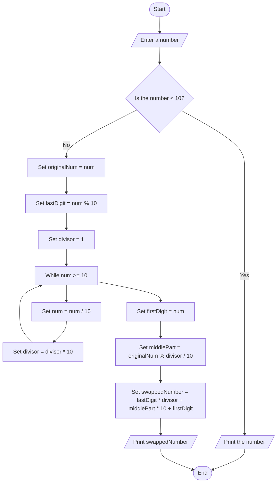

Problem Analysis 
1. Input:
    User input: A single integer num.
2. Process:
    - Edge Case: If the number is a single digit (i.e., num < 10), it’s returned as is, since there are no digits to swap.
    - Extract First and Last Digits:
        Last digit: The last digit of the number is obtained using num % 10.
        First digit: The first digit is extracted by repeatedly dividing the number by 10 until it’s less than 10.
    - Middle part: The middle part of the number (all digits except the first and last) is obtained by - subtracting the first and last digits and dividing by 10.
    - Swapping the Digits:
    - The last digit becomes the first digit, and the first digit becomes the last digit, while the middle part remains unchanged.
    - Construct the new number by multiplying the last digit by the appropriate power of 10 and adding the middle part and first digit.
    - Output: The new number with the first and last digits swapped.
3. Output:
    The number after swapping its first and last digits.

Pseudocode
1. Start 
2. Ask the user to input a number.
3. Check if the number is a single digit (num < 10):
     If true, print the number and exit.
4. Store the original number (originalNum = num).
5. Extract the last digit (lastDigit = num % 10).
6. Extract the first digit by dividing the number by 10 until it becomes less than 10 (firstDigit = num after dividing by 10 repeatedly).
7. Extract the middle part (middlePart = (originalNum % divisor) / 10).
8. Construct the swapped number using lastDigit * divisor + middlePart * 10 + firstDigit.
9. Print the swapped number.
10. End

# Flowchart for Swapping First and Last Digits of a Number


```
