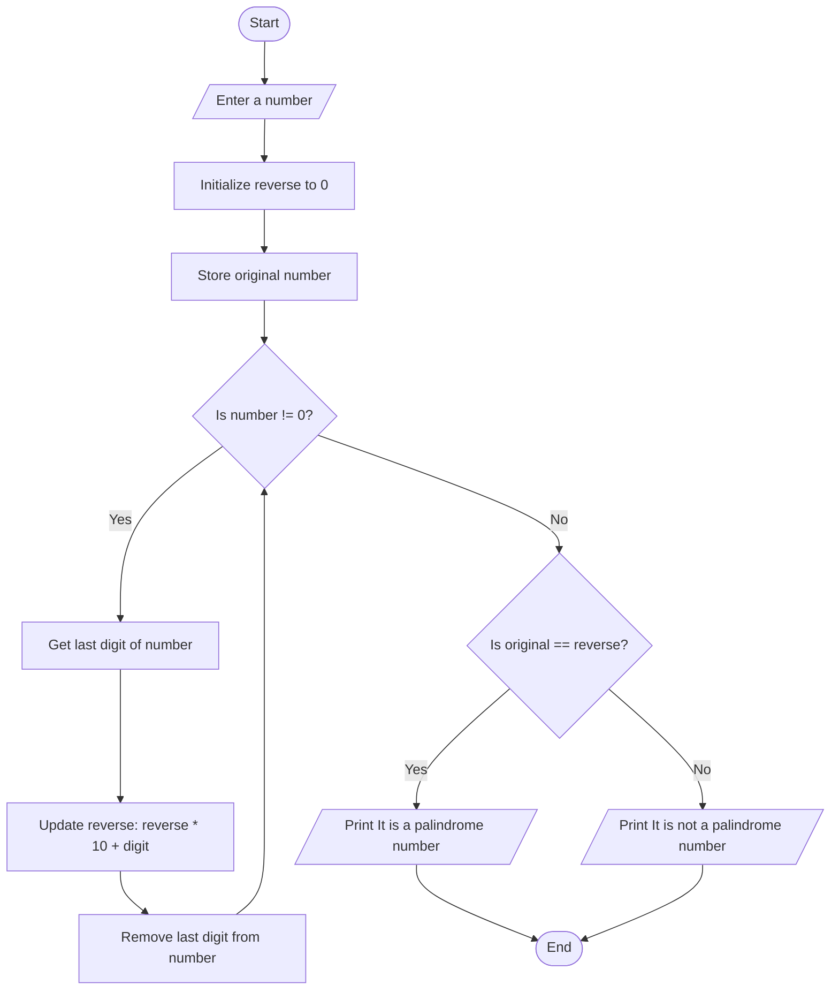

Problem Analysis 
1. Input:
    read a single integer, number, from the user.
2. Process:
    - stores the original number in a variable original to compare it later.
    - initializes a variable reverse to 0, which will store the reversed version of the input number.
    - A while loop is used to reverse the number by extracting its digits and adding them to the reverse variable. This process continues until the number becomes 0.
    - After reversing, the program compares the reversed number (reverse) with the original number (original).
    - If both are equal, the number is a palindrome.
    - Otherwise, the number is not a palindrome.
3. Output:
    The program prints whether the number is a palindrome or not.
Pseudocode:

1. Start

2. Declare variables:
   - number (integer): The number input by the user.
   - reverse (integer): Stores the reversed number (initialized to 0).
   - original (integer): Stores the original number to compare later.

3. Prompt the user to enter the number.

4. Store the original number in variable original.

5. While number is not 0:
   - Extract the last digit using number % 10.
   - Multiply reverse by 10 and add the extracted digit to reverse.
   - Remove the last digit from number using number = number / 10.

6. If original is equal to reverse:
   - Print "It is a palindrome number."
   - Else:
     - Print "It is not a palindrome number."

7. End

   # Flowchart: Check whether a number is palindrome or not


```
