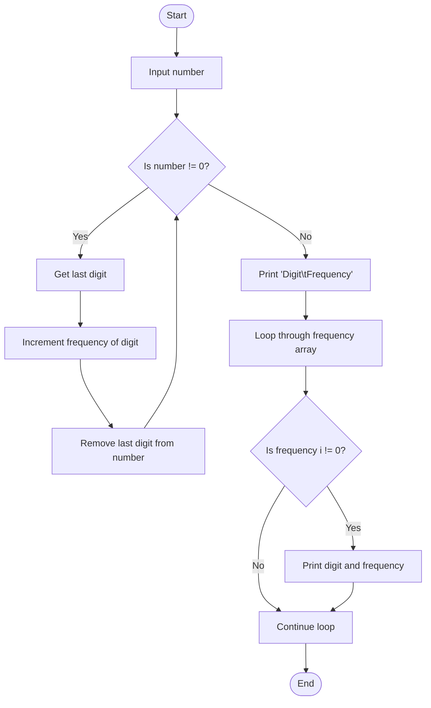

Problem Analysis 
1. Input:
    User input: A single positive integer number.
2. Process:
    - Initialize a frequency array (frequency[10] = {0}) to store the count of each digit (from 0 to 9).
    - The array has 10 elements, each representing a digit from 0 to 9, and is initialized to zero.
    - Extract and Count Digits:
    - Use a while loop to extract each digit of the number by performing number % 10 to get the last digit.
    - Increment the corresponding index in the frequency array (e.g., for digit 5, increment frequency[5]).
    - Remove the last digit from the number by dividing it by 10 (number /= 10).
    - Display Frequencies:
    - After processing all the digits, use a for loop to display the frequency of each digit that appears in the number.
    - Only print digits that have a non-zero frequency.
3. Output:
    The program will display the frequency of each digit that appears in the input number.


Pseudocode
1. Start 
2. Ask the user to input a positive integer.
3. Initialize an array frequency[10] with zeros to store the frequency of digits.
4. While number != 0:
   
    - Get the last digit of number using digit = number % 10.
    - Increment the corresponding position in the frequency array (frequency[digit]).
    - Remove the last digit from number by dividing by 10 (number /= 10).
5. For each index i from 0 to 9:
6. If frequency[i] != 0, print the digit and its frequency.
7. End

## FLOWCHART 

```
