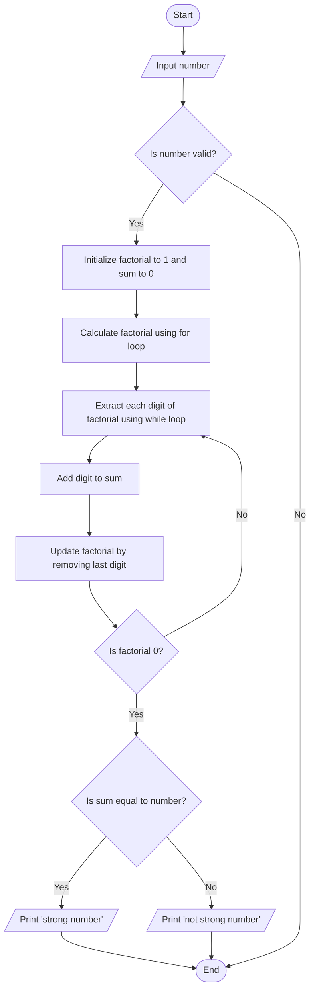

Problem Analysis 
1. Input:
    User input: A single integer number.
2. Process:
    - Factorial Calculation: The program calculates the factorial of the given number.
    - The factorial of a number n is the product of all positive integers less than or equal to n. 
    - Digit Sum of Factorial: After calculating the factorial, the program finds the sum of the digits of the factorial.
    - This is done by repeatedly extracting the last digit of the factorial using modulo (% 10) and adding it to the sum. The number is then reduced by dividing it by 10.
    - Comparison: The sum of the digits of the factorial is compared with the original number:
    - If the sum is equal to the original number, then the number is a strong number.
    - Otherwise, it is not a strong number.
3. Output:
    If the sum of the digits of the factorial equals the original number, output: "strong number".
    Otherwise, output: "not strong number".

1. START
2. PRINT "Enter a number: "
3. READ number
4. Initialize factorial = 1, Initialize sum = 0
5. FOR i = 1 TO number DO
        - factorial = factorial * i
    
    - WHILE factorial != 0 DO
      
        - digit = factorial % 10
        - sum = sum + digit
        - factorial = factorial / 10
    
6. IF sum == number THEN

   - PRINT "strong number"
7. ELSE

   - PRINT "not strong number"
    
8. END


# Flowchart for Strong Number Program


```
