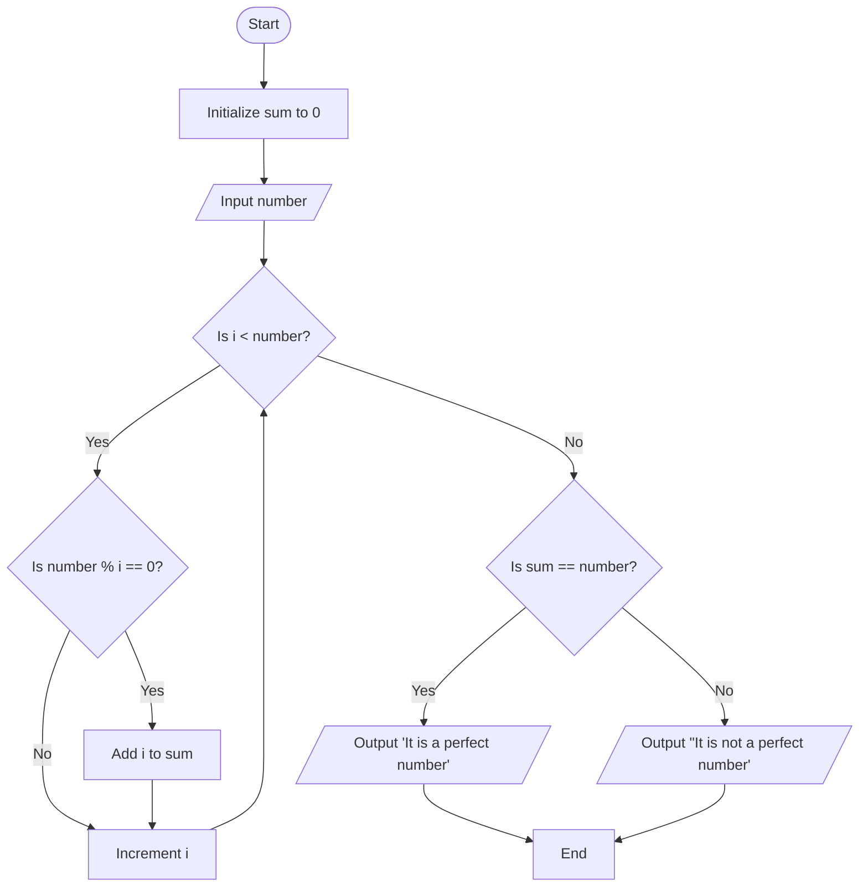

Problem Analysis 
1. Input:
    User input: A single integer, number.
2. Process:
    - Initialize sum = 0 to store the sum of divisors of the number.
    - Loop through integers from 1 to number - 1 to find the divisors:
    - If i is a divisor of number (i.e., number % i == 0), add i to sum.
        -After the loop, check if the sum of divisors is equal to the original number (sum == number):
    - If true, the number is a perfect number.
    - If false, the number is not a perfect number.
        Print the result accordingly.
3. Output:
    - If the sum of divisors is equal to the number, print: "It is a perfect number".
    - Otherwise, print: "It is not a perfect number".


Pseudocode

1. START
2. READ number
3 Initialize sum = 0

   - FOR i = 1 TO number - 1 DO
     - IF number % i == 0 THEN
            - sum = sum + i

    
3.IF sum == number THEN
        
        - PRINT "It is a perfect number"
4. ELSE

       - PRINT "It is not a perfect number"
    
6. END
# Flowchart for Perfect Number Program


```
