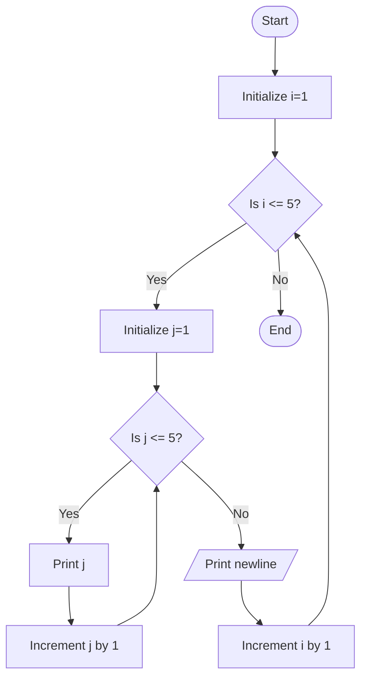

Problem Analysis 
1. Input:
No input is required for this program. It is designed to print a fixed pattern based on a predefined number of iterations (5 in this case).
2. Process:
    - The outer for loop runs 5 times (for i from 1 to 5).
    - Inside the outer loop, there is an inner for loop that also runs 5 times (for j from 1 to 5).
    - The inner loop prints the value of j followed by a space on the same line.
    - After the inner loop finishes, a cout << endl; is used to move to the next line.
    - The outer loop then moves to the next iteration, repeating the process.
3. Output:
    -The program outputs the numbers from 1 to 5, five times, each on a new line, creating a grid-like pattern.

Pseudocode:

1. Start

2. For i = 1 to 5:
   - For j = 1 to 5:
     - Print the value of j followed by a space
   - Print a new line (to move to the next row)

3. End

## Flowchart

