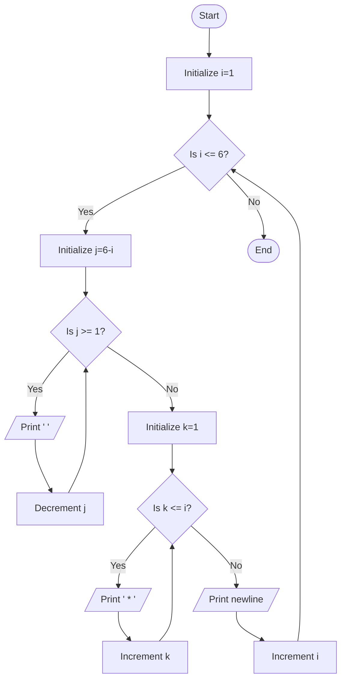

Problem Analysis 
1. Input:
    No user input is required.
    The program generates a predefined right-aligned triangle pattern of stars with 6 rows.
2. Process:
    - Outer loop (i): Controls the number of rows, running from 1 to 6.
    - For each row:
    - Inner loop 1 (j): Prints leading spaces to create the right-alignment. The number of spaces  decreases as the row number increases (6 - i spaces for row i).
    - Inner loop 2 (k): Prints the stars (* ) in each row. The number of stars printed in each row is equal to the row number (i stars for row i).
    - After printing each row's stars, move to the next line .
Output :
    
    - Row 1: 5 spaces, 1 star : *
    - Row 2: 4 spaces, 2 stars: * *
    - Row 3: 3 spaces, 3 stars: * * *
    - Row 4: 2 spaces, 4 stars: * * * *
    - Row 5: 1 space,  5 stars: * * * * *
    - Row 6: 0 spaces, 6 stars: * * * * * *

Pseudocode
1. Start the program.
2. Use an outer loop (i) to control the number of rows, from 1 to 6:
    - For each row i:
        - Use an inner loop 1 (j) to print spaces (6 - i spaces).
        - Use an inner loop 2 (k) to print stars (* ) (i stars in row i).
    - After completing the row, move to the next line (cout << endl).
3.End

