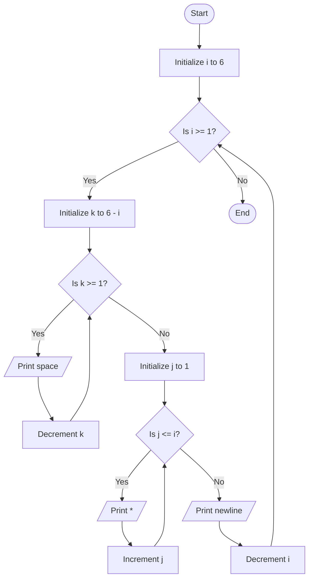

Problem Analysis 
1. Input:

   - No user input is required.
   - The program generates a predefined inverted right-aligned triangle pattern of stars with 6 rows.
3. Process:
    - Outer loop (i): Controls the number of rows, starting from 6 and decreasing to 1.
    - The number of stars printed in each row decreases with each iteration (i.e., row 1 has 6 stars, row 2 has 5 stars, etc.).
    - For each row:
    - Inner loop 1 (k): Prints leading spaces. The number of spaces increases as the row number decreases (6 - i spaces for row i).
    - Inner loop 2 (j): Prints the stars (*). The number of stars printed is equal to the current row number (i stars for row i).
    - After printing each row's stars, move to the next line using cout << endl.
Output :
    
    - Row 1 (i = 6): 0 spaces, 6 stars: * * * * * *
    - Row 2 (i = 5): 1 space,  5 stars:  * * * * *
    - Row 3 (i = 4): 2 spaces, 4 stars:   * * * *
    - Row 4 (i = 3): 3 spaces, 3 stars:    * * *
    - Row 5 (i = 2): 4 spaces, 2 stars:     * *
    - Row 6 (i = 1): 5 spaces, 1 star :      *

Pseudocode
1. Start 
2. Use an outer loop (i) to iterate over rows from 6 to 1:
    
    - For each row i:
        - Use inner loop 1 (k) to print spaces: loop from k = 1 to k = (6 - i).
        - Use inner loop 2 (j) to print stars: loop from j = 1 to j = i.
    - After each row, move to the next line .
3. End 
# Flowchart for the given C++ code

