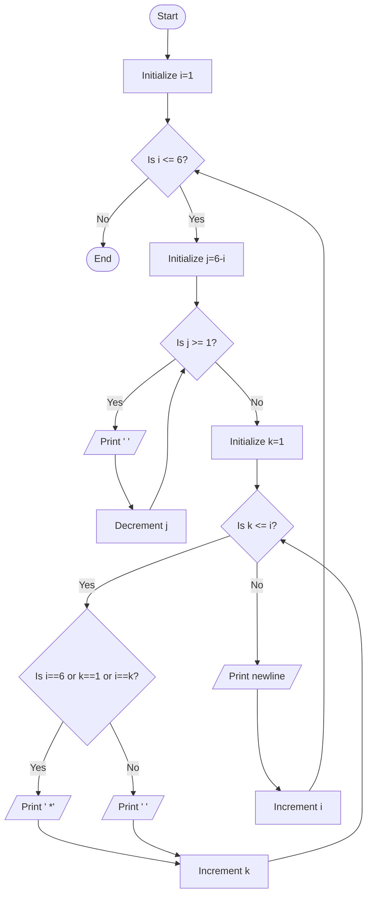

Problem Analysis 
1. Input:

   - No user input is required.
   - The program generates a predefined hollow right-aligned triangle pattern of stars with 6 rows.
3. Process:

    - Inner loop 1 (j): Prints spaces. The number of spaces printed before the stars decreases as the row number increases (6 - i spaces for row i).
    - inner loop 2 (k): Prints the stars (*)
        - condition 1: Print a star if:
            - The current row is the last row (i == 6), or
            - The current column is the first column (k == 1), or
            - The current column is the diagonal (when i == k).
        - Condition 2: Otherwise, print two spaces to create a hollow space.
5. Output :

      - Row 1 (i = 1): 5 spaces, 1 star
      - Row 2 (i = 2): 4 spaces, 1 star, 1 hollow space, 1 star
      - Row 3 (i = 3): 3 spaces, 1 star, 1 hollow space, 1 star
      - Row 4 (i = 4): 2 spaces, 1 star, 2 hollow spaces, 1 star
      - Row 5 (i = 5): 1 space, 1 star, 3 hollow spaces, 1 star
      - Row 6 (i = 6): 0 spaces, 6 stars
                                                                                      

Pseudocode
1. Start 
2. Use an outer loop (i) to iterate over rows from 1 to 6:
    - For each row i:
    - Use inner loop 1 (j) to print spaces: loop from j = 1 to j = (6 - i).
    - Use inner loop 2 (k) to print stars or spaces:
        - If i == 6 (last row), or k == 1 (first column), or i == k (diagonal), print a star (*).
        - Otherwise, print two spaces ( ) for hollow space.
    - After each row, move to the next line (cout << endl).
3. End
   ## FLOWCHART 

