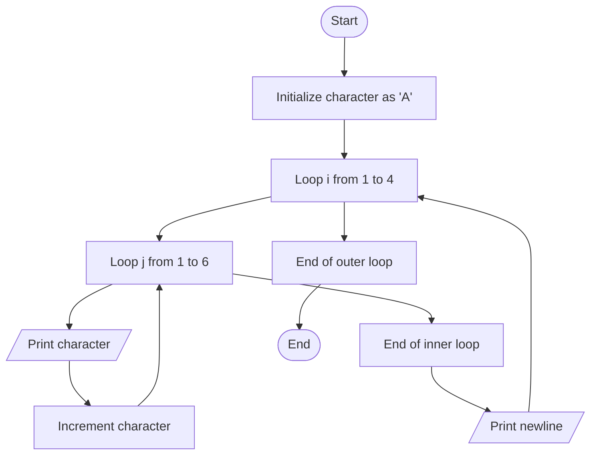

Problem Analysis 
1. Input:
    
    - No input is required for this program. It generates a pattern of alphabetic characters starting from 'A'.
2. Process:
    
    - The outer for loop runs 4 times (for i from 1 to 4), each iteration representing a row in the pattern.
    - The inner for loop runs 6 times (for j from 1 to 6), each iteration printing one character in the row.
    -The character variable, initially set to 'A', is printed in each iteration of the inner loop. After printing, it is incremented to the next letter (using character++).
    - After each row is printed, the program moves to a new line .
3. Output:
    
    - The program outputs a grid of characters, starting from 'A', with 4 rows and 6 columns.
   
Pseudocode:

1. Start

2. Initialize character to 'A'.

3. For i = 1 to 4 (outer loop for rows):
   - For j = 1 to 6 (inner loop for columns):
     - Print the current value of character followed by a space.
     - Increment character by 1.

   - After completing inner loop, print a new line.

4. End

## Flowchart

