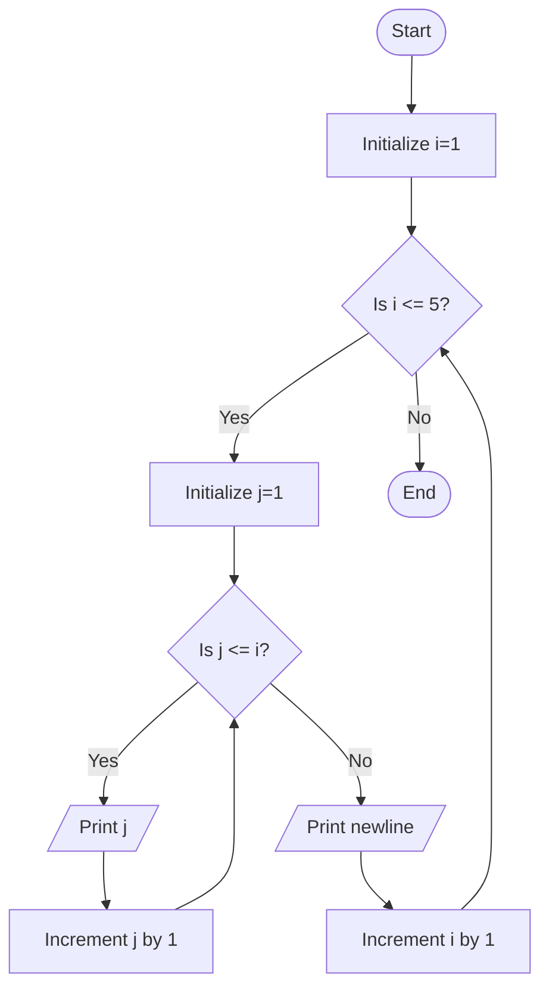

Problem Analysis
1. Input:
 
    - No explicit user input is required.
    - The program uses predefined constants for the number of rows (5) and generates the pattern based on those values.
2. Process:
 
    - Outer Loop (i):
        - Runs from 1 to 5 .
        - Controls the number of rows in the output.
    - Inner Loop (j):
        - Runs from 1 to the current row number (i).
        - Controls the numbers printed in each row.
        - Prints the values of j, separated by spaces.
        - After completing a row:
        - A newline character is printed to move to the next row.
3. Output:

   - The program outputs a triangular number pattern:
     
    - Row 1: 1
    - Row 2: 1 2
    - Row 3: 1 2 3
    - Row 4: 1 2 3 4
    - Row 5: 1 2 3 4 5

1. start
2. use FOR loop (Outer loop) controls rows
3. use another FOR loop (Inner loop) controls numbers in each row
      - Print the current number
      - Print a space after the number
    
    Move to the next row
  
4. END
## Flowchart

