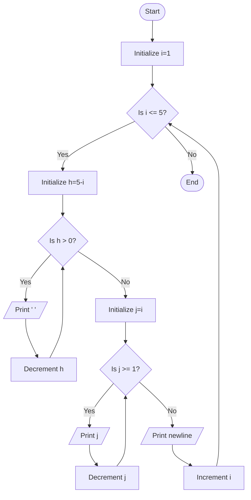

## Flowchart

```mermaid
graph TD
    A([Start]) --> B[Initialize i=1]
    B --> C{Is i <= 5?}
    C -- Yes --> D[Initialize h=5-i]
    D --> E{Is h > 0?}
    E -- Yes --> F[/Print ' ' /]
    F --> G[Decrement h]
    G --> E
    E -- No --> H[Initialize j=i]
    H --> I{Is j >= 1?}
    I -- Yes --> J[/Print j/]
    J --> K[Decrement j]
    K --> I
    I -- No --> L[/Print newline/]
    L --> M[Increment i]
    M --> C
    C -- No --> N([End])
```
