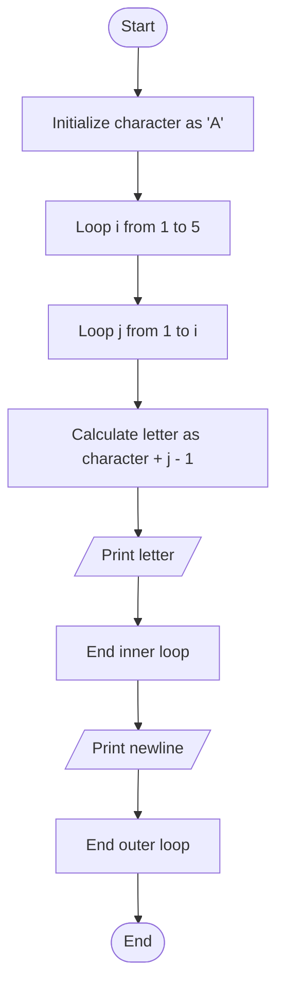

Problem Analysis 
1. Input:
    
    - No user input is required.
    - The program is designed to generate a pattern based on a fixed number of rows (5).
2. Process:
    - Start with a character character = 'A'.
    - Use an outer loop to manage rows (i from 1 to 5).
    - For each row, use a nested loop (j from 1 to i) to calculate and print the letters.
    - The letter in column j of row i is calculated as character + j - 1.
    - After printing all letters in the current row, move to the next line.
3. Output :
     
      - Row 1: Prints 1 character : A
      - Row 2: Prints 2 characters: A B
      - Row 3: Prints 3 characters: A B C
      - Row 4: Prints 4 characters: A B C D
      - Row 5: Prints 5 characters: A B C D E

Pseudocode

1. Start 
2. Declare a character variable character initialized to 'A'.
3. Initialize a loop for rows, i from 1 to 5:
    
    - Initialize a nested loop for columns, j from 1 to i:
        - Calculate the letter to print as character + j - 1.
        - Print the calculated letter followed by a space.
   -  Move to the next line after completing the row.
4. End

## Flowchart

