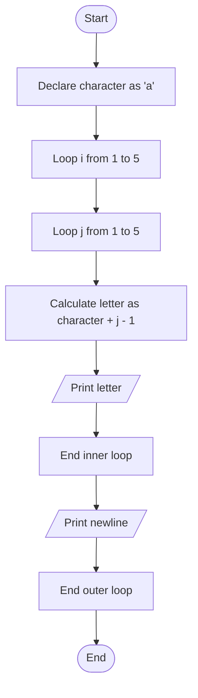

Problem Analysis (Input, Process, Output)
1. Input:
   
    - No user input. The grid size is fixed (5x5), starting character is 'a'.
2. Process:

      - Initialization: Set character = 'a'.
      - Outer Loop (Rows): Iterate 5 times (for 5 rows).
      - Inner Loop (Columns): For each row, iterate 5 times to print letters from 'a' to 'e'.
      - Calculate letter as character + (j - 1) for each column.
      - Print: Print letters with spaces, and after each row, move to the next line.
3. Output:
   - Row 1: a b c d e
   - Row 2: a b c d e
   - Row 3: a b c d e
   - Row 4: a b c d e
   - Row 5: a b c d e

Pseudocode

1. Initialize character as 'a'
2. For i from 1 to 5 (rows):

   - For j from 1 to 5 (columns):
        - letter = character + (j - 1)
        - Print letter followed by a space
    - Print a newline after the inner loop
3. End

# Flowchart for the given C++ code


```
