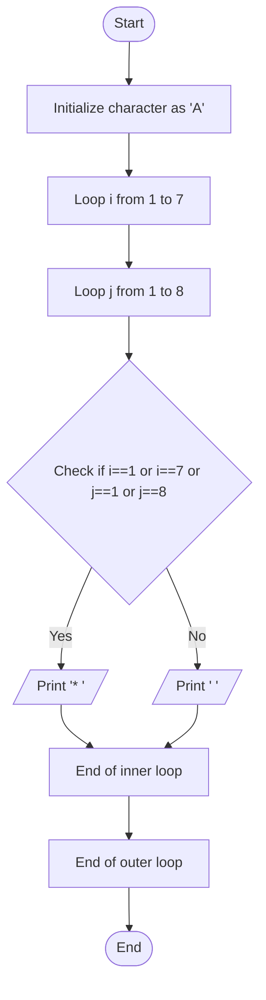

Problem Analysis 
1. Input:
    - No user input is required.
    - The program generates a predefined rectangular pattern of size 7 rows and 8 columns.
2. Process:
    
    - Initialize a character variable character = 'A' (not used in the logic but declared).
    - Use an outer loop (i) to iterate through rows (from 1 to 7).
    - For each row, use an inner loop (j) to iterate through columns (from 1 to 8):
    - Condition 1: If the current position is on the border (i == 1, i == 7, j == 1, or j == 8):
        - Print * (a star followed by a space).
    - Condition 2: If the current position is inside the border:
        - Print two spaces .
    - After printing all columns in a row, move to the next line .
      
3. Output :

      - Row 1: All columns are stars:                                                  * * * * * * * *
      - Row 2 to 6: Only the first and last columns are stars, with spaces in between: *             *
      - Row 3 to 6: Only the first and last columns are stars, with spaces in between: *             *
      - Row 4 to 6: Only the first and last columns are stars, with spaces in between: *             *
      - Row 5 to 6: Only the first and last columns are stars, with spaces in between: *             *
      - Row 6 to 6: Only the first and last columns are stars, with spaces in between: *             *
      - Row 7: All columns are stars:                                                  * * * * * * * *

Pseudocode


1. Start 
2. Initialize a character variable character = 'A' (not used in the logic).
3. Use an outer loop for rows (i from 1 to 7):

   - Use an inner loop for columns (j from 1 to 8):
        - If the current position is on the border: (i == 1 or i == 7 or j == 1 or j == 8)
            -Print * (a star followed by a space).
        - Else:
            - Print two spaces ( ).
    - Move to the next line after completing the row.
4. End
   # Flowchart for the Given C++ Code


```
