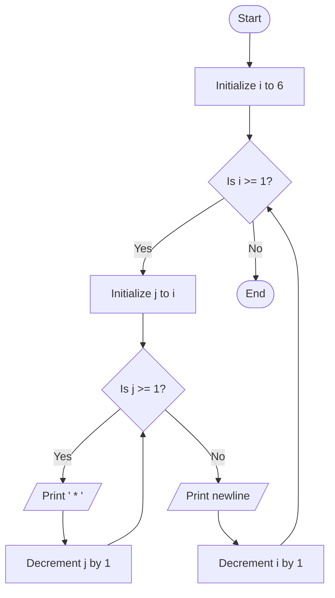

Problem Analysis 
1. Input:
    No user input is required.
    The program generates a predefined inverted half-pyramid pattern with 6 rows.
2. Process:
    - Use an outer loop (i) to iterate through rows, starting from 6 and decreasing to 1:
    - The number of stars in a row is equal to the current row number (i).
    - For each row, use an inner loop (j) to print * (i times):
    - Decrement j in each iteration to control the number of stars in the current row.
    - fter printing all stars for a row, move to the next line using cout << endl.
3. Output (Row-wise Explanation):

    - Row 1: Prints 6 stars: * * * * * *
    - Row 2: Prints 5 stars: * * * * *
    - Row 3: Prints 4 stars: * * * *
    - Row 4: Prints 3 stars: * * *
    - Row 5: Prints 2 stars: * *
    - Row 6: Prints 1 star : *

Pseudocode

1. Start 
2. Use an outer loop (i):

   - Initialize i = 6.
   - Loop until i >= 1, decrement i by 1 each iteration.
    - For each i:
        - Use an inner loop (j):
            - Initialize j = i.
            - Loop until j >= 1, decrement j by 1 each iteration.
            - Print * (a star followed by a space).
    -  After the inner loop ends, move to the next line .
4. End
## Flowchart

