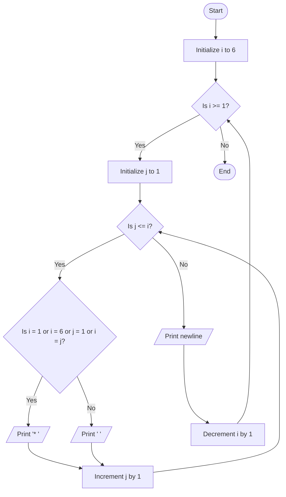

Problem Analysis 
1. Input:
    
    - No user input is required.
    - The program generates a predefined hollow inverted half-pyramid pattern with 6 rows.
2. Process:
    - Use an outer loop (i) to iterate through rows, starting from 6 and decreasing to 1:
    - The number of columns in each row is equal to the current row number (i).
        - For each row, use an inner loop (j) to handle the columns (j from 1 to i):
        - Print * if:
            - The row is the first (i == 6) or last (i == 1), or
            - The column is the first (j == 1), or
            - The column matches the current row number (i == j).
        - Otherwise, print two spaces ( ) for hollow spaces.
    - Move to the next line after completing each row using cout << endl.
3 Output (Row-wise Explanation):

   - Row 1 (i = 6): * * * * * * 
   - Row 2 (i = 5): *        * 
   - Row 3 (i = 4): *      * 
   - Row 4 (i = 3): *    * 
   - Row 5 (i = 2): *  * 
   - Row 6 (i = 1): * 

Pseudocode

1. Start 
2. Use an outer loop (i):
    - Initialize i = 6.
    - Loop until i >= 1, decrement i by 1 each iteration.
    - For each row (i):
    - Use an inner loop (j):
    - Initialize j = 1.
    - Loop until j <= i, increment j by 1 each iteration.
    - If the current position satisfies:
        i == 1 (bottom row), or
        i == 6 (top row), or
        j == 1 (first column), or
        j == i (diagonal from top-right to bottom-left):
        Print * .
    - Else, print two spaces ( ).
    - After the inner loop, move to the next line (cout << endl).
3. End
   ## Flowchart


```
