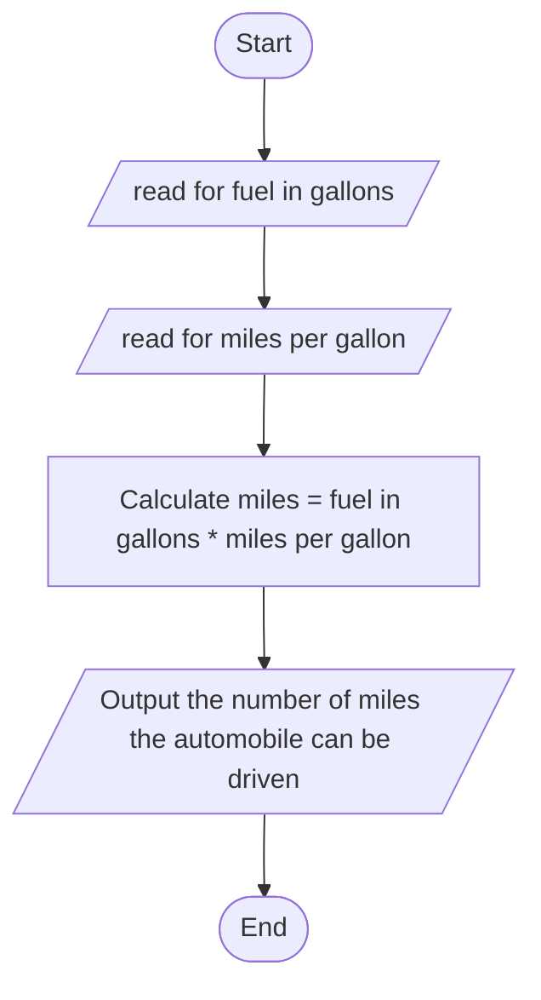

## Algorithm for the mile calculator

1. Input:

    - the fuel tank capacity in gallons.

    - the miles per gallon .

2. Process:

    - mile = fuel_in_gallon × miles_per_gallons
   
3. Output:

    - the total mile

## Algorithm Design

  ## pseudocode

Step 1: Start

Step 2: Initialize Variables
        
        2.1. Declare variables fuel_in_gallon, miles_per_gallons, and mile.

Step 3: Input Data

        3.1. Prompt the user to enter the fuel in gallons.
        
        3.2. Store the input value in fuel_in_gallon.
        
        3.3. Prompt the user to enter the miles per gallon.
        
        3.4. Store the input value in miles_per_gallons.

Step 4: Calculate Distance
        
        4.1. Calculate the distance the automobile can travel without refueling:
        
        - mile = fuel_in_gallon * miles_per_gallons.

Step 5: Output Result
        
        5.1. Display the result: "The automobile can be driven mile miles without refueling."

Step 6: End

# Flowchart

