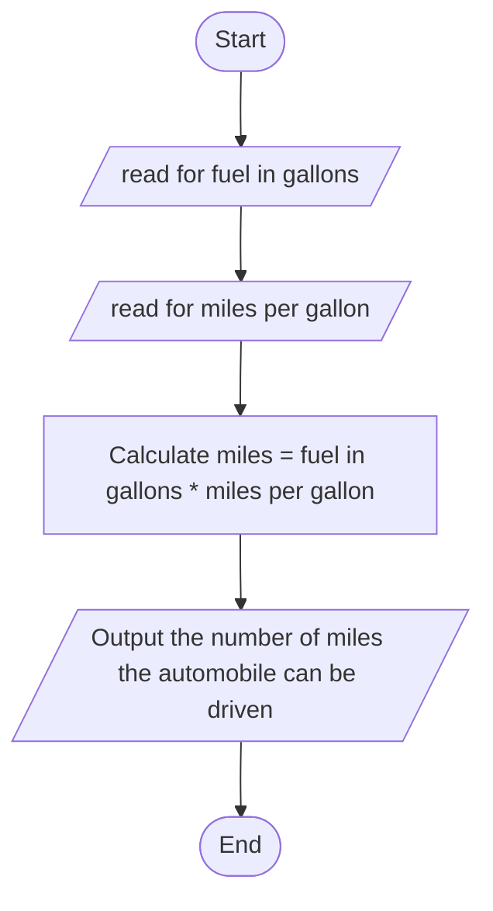

```mermaid
flowchart TD
    A([Start]) --> B[/read for fuel in gallons/]
    B --> C[/read for miles per gallon/]
    C --> D[Calculate miles = fuel in gallons * miles per gallon]
    D --> E[/Output the number of miles the automobile can be driven/]
    E --> F([End])
```
