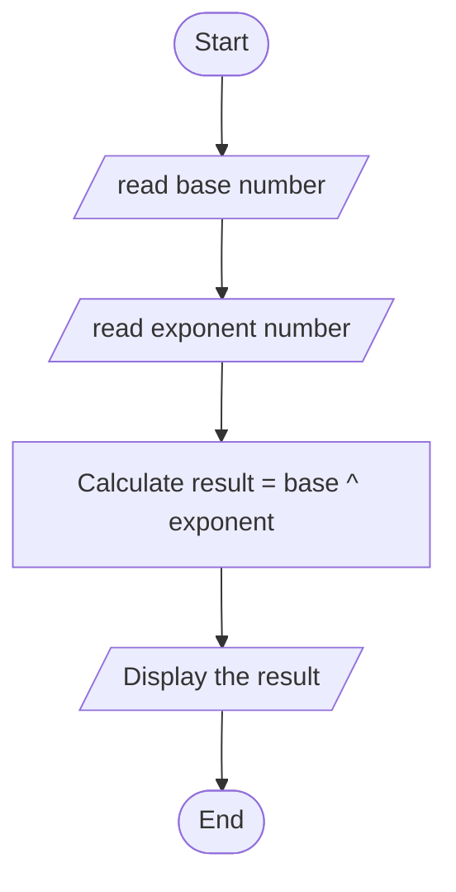

## Algorithm
1. Input:

     - Prompt the user to enter the base number.
     - Prompt the user to enter the exponent.
2. Process:
   
     - result = base^exponent

3. Output:

     - The result is {result}

## Algorithm Design
  Pseudocode
   
   
Step 1: Start

Step 2: Initialize Variables
     
     2.1. Declare variables base, exponent, and result.

Step 3: Input Data

     3.1. Prompt the user to enter the base of the number.
     
     3.2. Store the input value in base.
     
     3.3. Prompt the user to enter the exponent.
     
     3.4. Store the input value in exponent.

Step 4: Calculate the Result
     
     4.1. Use the formula result = pow(base, exponent) to calculate the value of x^y

Step 5: Output Result
     
     5.1. Display the result: "The result is result."

Step 6: End

# Flowchart 

