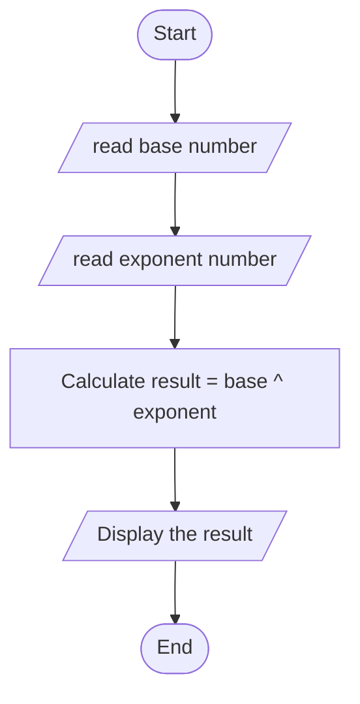

```mermaid
flowchart TD
    A([Start]) --> B[/read base number/]
    B --> C[/read exponent number/]
    C --> D[Calculate result = base ^ exponent]
    D --> E[/Display the result/]
    E --> F([End])
```
